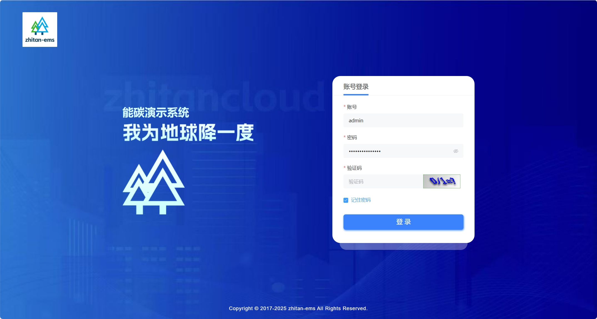
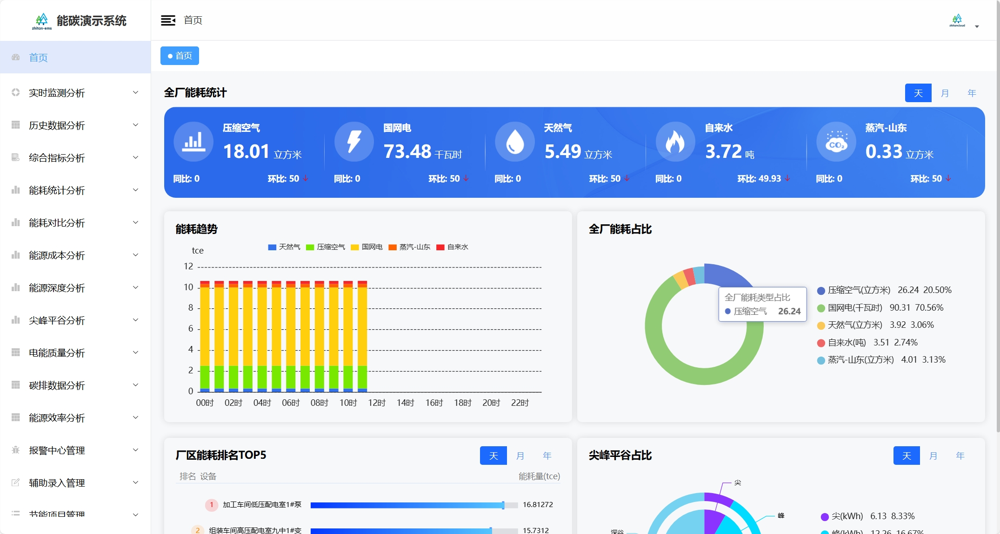
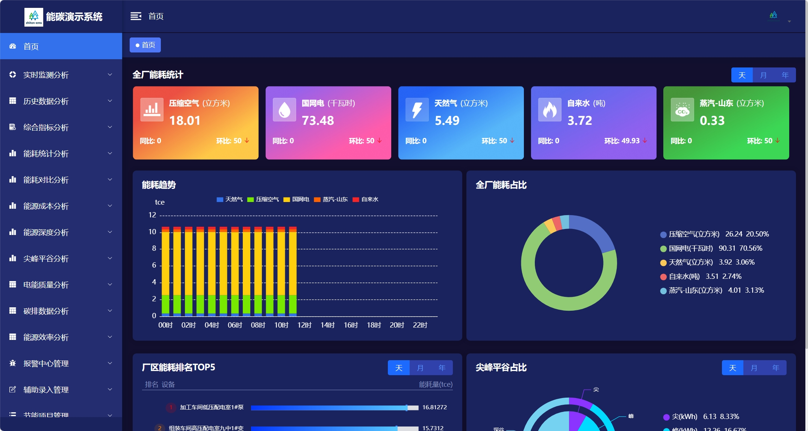
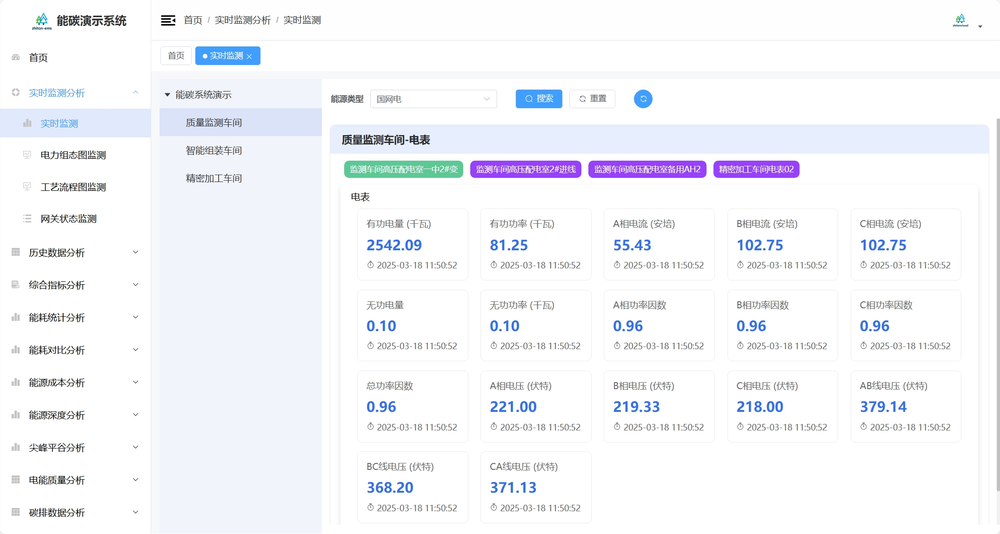
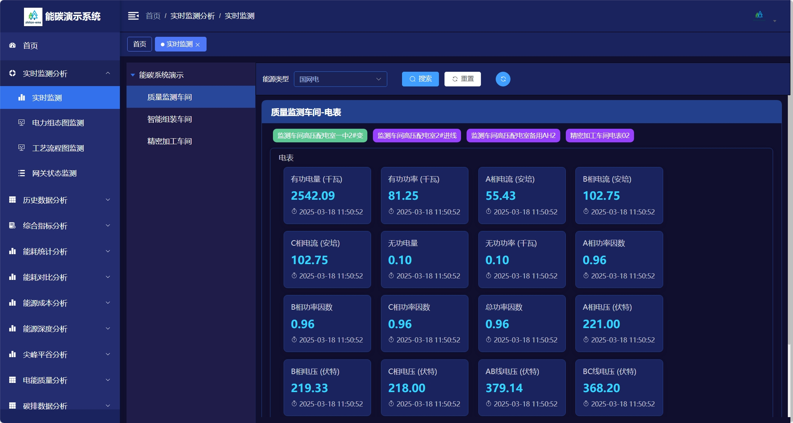
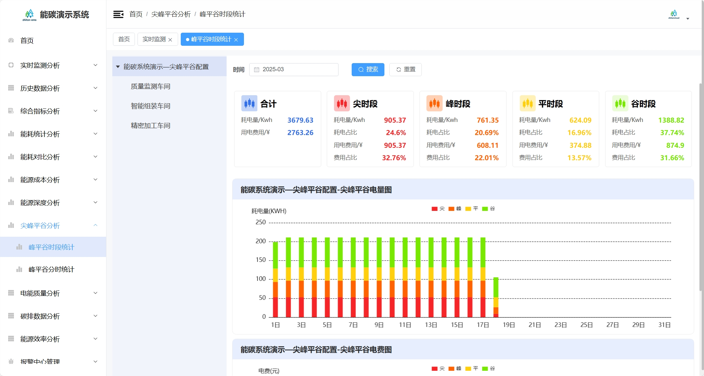
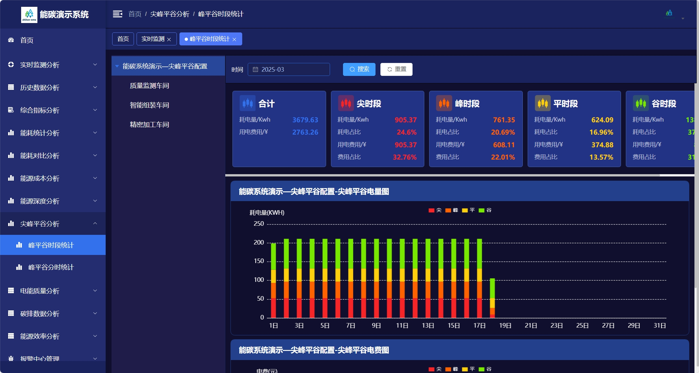
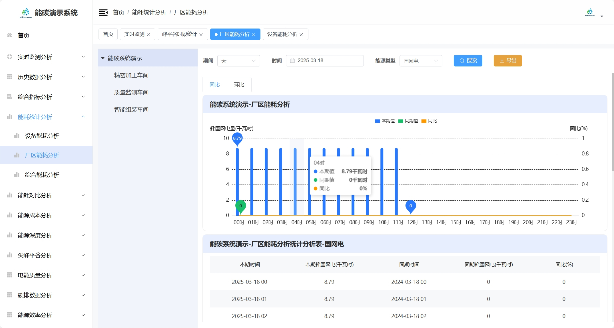
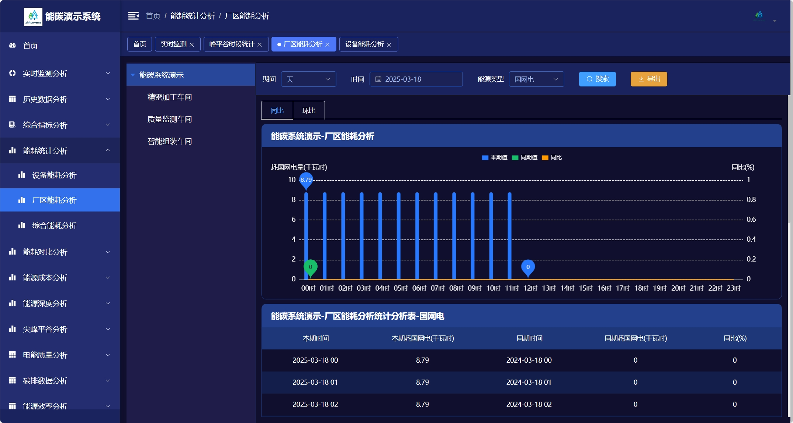

    

<h1 align="center" style="margin: 30px 0 30px; font-weight: bold;">智碳能源管理系统</h1>

基于SpringBoot和若依框架开发

能碳平台后台展示代码完备，功能齐全，运行正常，数采和数据清洗部分网上开源的库很多，学习者可以参考友商集成

    <a href='https://gitee.com/liulingling1993/zhitan-ems/stargazers'></img></a>
    <a href='https://gitee.com/liulingling1993/zhitan-ems/members'></img></a>

## 介绍
能源管理系统，采集企业水、电、气、热等能耗数据，帮企业建立能源管理体系，找到跑冒滴漏，从而为企业节能提供依据。
进一步为企业实现碳跟踪、碳盘查、碳交易、碳汇报的全生命过程。 为中国碳达峰-碳中和做出贡献。

针对客户场景：政府、园区、企业、工矿、公共建筑等。

## 【注意】完整能碳管理平台包含三个部分，本项目只开源了能碳平台展示端
##### 能碳平台展示端：也即本项目能碳平台后台展示部分，代码完备，运行正常。通过本项目，学习者可以掌握能源管理行业的功能和业务，以及技术架构。
##### 数据采集程序：也即mqtt➡️时序库功能，市面上开源库非常多，可参考thingsjs等知名项目，或者自己用netty自己实现。
##### 数据清洗服务：也即时序库➡️关系库，学习者可以使用java自带的XXL job等计划任务工具自己按照业务功能，来实现数据清洗服务。

## 关于问题答疑

#####  因总是有人恶意举报我们仓库，说我们做商业推广，顾我已经删除了所有联系方式和交流群
##### 演示demo也换成了中性的名字（我们也不知道git被举报的规则是什么。。。）
#####  所以大家如果有问题，提issue吧。。。
##

## 在线体验

- guestUser/guest@123456

演示地址：https://demo-ems.zhitancloud.com/  

## 框架：

基于SpringBoot的若依框架 易读易懂、界面简洁美观。支持深色&浅色两种风格切换（演示系统右上角）   
关系数据库：postgresql（mysql需自行适配，mysql性能太差了）   
时序数据库：influxdb 2.7+  
中间件：redis  
VUE版本：VUE 3

## 特色：数据驱动的计算模型和业务模型配置
1.  支持动态点位配置。

2.  支持计算公式。

3.  支持模型配置、包括数据模型、业务模型。

4.  复杂项目底层代码&数据结构完全不需要变化，可快速交付实施。
5.  已完成标准化的网关&电表等采集设备对接，快速为客户软硬件一体化交付。

## 亮点功能

## 功能列表
1.  首页看板
2.  实时数据监测  
    2.1.  实时数据查看  
    2.2.  组态图分析（svg 图绑定）
3. 历史点位分析
4. 综合指标分析  
   4.1.  综合指标分析（日）  
   4.2.  综合指标分析（月）  
   4.3.  综合指标分析（年）
5. 重点设备分析  
   5.1.  重点设备分析（日）  
   5.2.  重点设备分析（月）    
   5.3.  重点设备分析（年）
6. 工序能耗分析  
   6.1.  工序能耗分析（日）  
   6.2.  工序能耗分析（月）    
   6.3.  工序能耗分析（年）
7. 尖峰平谷分析  
   7.1.  尖峰平谷配置  
   7.2.  尖峰平谷数据
8. 能耗对比分析（各能源品种）  
   8.1.  电同环比分析      
   8.2.  水同环比分析
   8.3.  其他能源品种分析
9. 智能报警  
   9.1.  报警分析        
   9.2.  报警配置
10. 单耗分析
11. 计划与实绩
12. 用能考核
13. 用能对标
14. 数据补录
15. 节能项目管理
16. 能源平衡分析
17. 能源对标分析
18. 模型配置管理（计算模型等）
19. 基础数据管理（字典、能源类型等）
20. 系统管理（用户、角色、权限等）

## UI展示（平台分深色和浅色两种风格切换）

    登录页面

    首页-浅色 

    首页-深色 

    实时监测-浅色 

    实时监测-深色 

    尖峰平谷-浅色 

    尖峰平谷-深色 

    区域能耗-浅色 

    区域能耗-深色 

## 业务架构

## 技术架构

## 沟通交流

扫码添加微信交流，加微信请备注：ems。

  

## 参与贡献

1.  Fork 本仓库
2.  新建 Feat_xxx 分支
3.  提交代码
4.  新建 Pull Request
